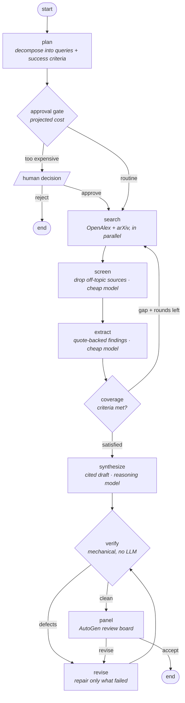

# scholar-graph

[](https://github.com/Bluetenhonig/scholar-graph/actions/workflows/ci.yml)
[](https://www.python.org/)
[](LICENSE)
[](https://mypy-lang.org/)

An evidence-grounded research agent built on **LangGraph**, with an **AutoGen**
review board — and the production scaffolding that usually gets left out of
agent demos: mechanical citation verification, hard cost budgets,
human-in-the-loop approval, durable resume, deterministic replay, and evals
that gate CI.

```bash
git clone https://github.com/Bluetenhonig/scholar-graph && cd scholar-graph
uv sync --extra dev --extra panel
uv run scholar-graph research "What techniques reduce LLM inference cost, and what do they trade away?"
```

**That command needs no API key and costs nothing.** It replays recorded
cassettes. See [Running it for real](#running-it-for-real) to point it at live
models and live paper databases.

---

## Why this repo exists

Most agent examples stop at "it produced an answer". The interesting problems
start after that:

| The problem | What this repo does about it |
| --- | --- |
| A research agent's worst failure is a **plausible answer with citations that don't support it**. A reader can't detect it without redoing the work. | Every `[Sn]` marker is resolved against retrieved sources, and every extracted quote is checked to exist verbatim in the source it names — **mechanically, with no model in the loop**. A draft that fails goes back for targeted repair. |
| Agents **loop**, and loops **spend**. | A hard USD budget, checked *before* each call. Bounded search rounds, revision rounds, and document counts. No termination condition depends on a model deciding it is done. |
| Agent code is **untestable** if every run costs money and returns different text. | Every model call and HTTP call is content-addressed and recorded. The full test suite and a complete end-to-end run execute offline, deterministically, for $0. |
| "It works on my machine, once." | 104 tests, strict `mypy`, and an eval suite with **thresholds that fail the build** on a regression in citation precision, groundedness, coverage or cost. |
| Expensive runs need a human. | The graph **suspends** at a cost gate via a LangGraph `interrupt`, persists to SQLite, and resumes from that exact point — in a different process, hours later. |

---

## The graph



Every loop is bounded: `max_search_rounds`, `MAX_REVISIONS`, `max_documents`,
and `max_usd_per_run`.

**Model tiering is deliberate.** Screening and extraction are high-volume,
low-judgement work and run on Haiku; planning, synthesis and revision run on
Opus. Spending frontier-model tokens deciding whether an abstract is on-topic
is how agent costs get away from you.

---

## The parts worth reading

### 1. Citation verification (`src/scholar_graph/verification.py`)

Three checks, none of which involve a model — the checker cannot be talked out
of its verdict by the thing it is checking:

1. **Marker resolution** — every `[Sn]` maps to a real retrieved source.
2. **Quote grounding** — every extracted quote appears in the source it cites.
   Matching tolerates transcription drift (a dropped article, normalised
   whitespace) but is **order-preserving**, so reordered or invented text fails.
3. **Uncited prose** — substantive paragraphs must carry a citation.

The nastiest case it catches is a *real quote attributed to the wrong paper* —
something a human reviewer essentially never spots by eye. There's a test for
exactly that.

### 2. Record / replay (`src/scholar_graph/llm/`)

Every request is hashed into a content-addressed cassette. Three modes:
`live`, `record`, `replay`.

- Editing a prompt changes the hash, so replay **misses loudly** with an error
  telling you how to re-record — rather than silently serving a stale response.
- Replayed runs still compute cost from token counts and the price table, so
  eval cost assertions stay meaningful without spending anything. Update the
  price table and historical cassettes re-price themselves.
- A missing cassette is treated as a developer error and propagates, instead of
  being swallowed by the "degrade on provider failure" handlers — otherwise a
  stale recording produces a confident, empty, vacuously-100%-precision report.
  (That bug happened during development. The re-raise is why it can't recur.)

### 3. The AutoGen bridge (`src/scholar_graph/panel/model_client.py`)

AutoGen ships an Anthropic client. This repo implements ~80 lines of
`ChatCompletionClient` adapter instead, so the review board goes through the
*same* provider as everything else.

That's not gold-plating. Using AutoGen's own client would open a second path to
the model that bypasses cassettes, cost accounting and the run budget — and a
budget that holds for "most" call sites is not a budget. With the adapter, the
multi-agent panel replays offline and its spend lands in the same ledger.

### 4. Graceful degradation

A research agent you can leave running unattended has to survive bad days:

- One search provider down → the run continues on the other, with a warning.
- Budget exhausted before synthesis → returns the extracted findings, correctly
  cited, instead of throwing the whole run away.
- Budget exhausted anywhere else → a service-level salvage reads the last
  checkpoint and reports from it.
- Review panel fails or AutoGen isn't installed → the report ships without it.
- Verification defects survive two repair attempts → ships **with the defects
  named in the output**, because a report that says where it is weak beats no
  report.

---

## Try it

```bash
# Offline, deterministic, free — replays recorded cassettes
uv run scholar-graph research "What techniques reduce LLM inference cost?"

# JSON instead of markdown
uv run scholar-graph research "..." --json -o report.json

# Skip the AutoGen panel
uv run scholar-graph research "..." --no-panel

# What's been recorded?
uv run scholar-graph cassettes

# HTTP API on :8000
uv run scholar-graph serve
```

The HTTP API submits runs in the background (a research run takes minutes; a
request that holds a connection open for minutes dies to the first proxy
timeout):

```bash
curl -X POST localhost:8000/runs -H 'content-type: application/json' \
     -d '{"question":"What techniques reduce LLM inference cost?"}'
# -> {"run_id":"a1b2c3","status":"running",...}

curl localhost:8000/runs/a1b2c3            # poll
curl -N localhost:8000/runs/a1b2c3/events  # or stream progress (SSE)

# If it suspended for cost approval:
curl -X POST localhost:8000/runs/a1b2c3/approval \
     -H 'content-type: application/json' -d '{"decision":"approve"}'
```

### Human-in-the-loop

```bash
$ SCHOLAR_GRAPH_REQUIRE_APPROVAL_OVER_USD=0.001 uv run scholar-graph research "..."
This run needs approval before it spends money.
  run id      7f3a9c1e0b22
  projected   $0.0580
  threshold   $0.0010
  budget cap  $0.5000

Approve with:  scholar-graph resume 7f3a9c1e0b22 --decision approve
```

The process can exit here. State is checkpointed to SQLite, and
`scholar-graph resume` picks up from exactly that point — there's a test that
resumes a run in a *fresh service instance* knowing nothing but the run id.

---

## Running it for real

```bash
export SCHOLAR_GRAPH_ANTHROPIC_API_KEY=sk-ant-...

# Record fresh cassettes while you run
SCHOLAR_GRAPH_LLM_MODE=record uv run scholar-graph research "your question"

# Or bypass cassettes entirely
SCHOLAR_GRAPH_LLM_MODE=live uv run scholar-graph research "your question"
```

Search uses **OpenAlex** (~250M works) and **arXiv**. Both are free and need no
key, which is why the demo retrieves real papers rather than mocking a
retriever and calling it a research agent.

> **About the shipped cassettes.** The recordings in `cassettes/` are
> **synthetic** — generated by `scripts/seed_cassettes.py` against a small
> fabricated corpus, so the repo runs end-to-end offline. They are genuine
> cache entries for genuine requests, and they exercise the real graph, real
> verification and real cost accounting; only the *content* is fabricated.
> **They tell you nothing about how well Claude performs this task.** Record
> real ones to measure that. See [`cassettes/README.md`](cassettes/README.md).

---

## Configuration

Every knob, via environment variables (or `.env` — see `.env.example`):

| Variable (prefix `SCHOLAR_GRAPH_`) | Default | Meaning |
| --- | --- | --- |
| `LLM_MODE` | `replay` | `replay` · `record` · `live` |
| `ANTHROPIC_API_KEY` | — | Required for `record` / `live` |
| `REASONING_MODEL` | `claude-opus-5` | Planning, synthesis, verification |
| `WORKER_MODEL` | `claude-haiku-4-5` | Screening, extraction |
| `MAX_USD_PER_RUN` | `0.50` | Hard ceiling, enforced before each call |
| `REQUIRE_APPROVAL_OVER_USD` | `0.25` | Above this, pause for a human |
| `MAX_SEARCH_ROUNDS` | `3` | Retrieval loop bound |
| `MAX_DOCUMENTS` | `24` | Corpus size bound |
| `ENABLE_REVIEW_PANEL` | `true` | AutoGen review board |
| `CHECKPOINT_DB` | `.scholar-graph/checkpoints.sqlite` | `None` for in-memory |
| `LOG_FORMAT` | `console` | `json` for production |

---

## Development

```bash
make install     # uv sync with dev + panel extras
make check       # ruff + mypy --strict + pytest
make eval        # eval suite against thresholds; non-zero exit on regression
make seed        # regenerate the synthetic demo cassettes
make serve       # run the API locally
make docker      # build the container image
```

**104 tests**, strict `mypy` clean, `ruff` clean. Tests fake exactly one thing
— the network boundary — so cassette keying, cost accounting, budget
enforcement and structured-output parsing all execute for real. Stubbing higher
up would test the stub instead of the system.

CI runs lint, types, tests on Python 3.11/3.12/3.13, and the eval gate.

---

## Documentation

- [`docs/architecture.md`](docs/architecture.md) — state machine, state channels, why the graph is shaped this way
- [`docs/evaluation.md`](docs/evaluation.md) — what is measured, why those metrics, how to extend the dataset
- [`docs/operations.md`](docs/operations.md) — running it in production: failure modes, cost control, observability, scaling limits
- [`docs/adr/`](docs/adr/) — architecture decision records, including the ones that argue *against* the obvious choice

## Related repositories

Same conventions throughout — content-addressed cassettes, offline replay, no
API key needed to reproduce any claim in the README.

- **[triage-graph](https://github.com/Bluetenhonig/triage-graph)** —
  support-ticket triage on LangGraph + AutoGen, where personal data never
  reaches the model and a policy engine vets every promise before it is sent.
- **[retrieval-graph](https://github.com/Bluetenhonig/retrieval-graph)** — RAG
  with retrieval scored separately from generation. Directly relevant here:
  this repo verifies that a citation is *real*, while that one measures whether
  the right source was ever retrieved in the first place. Its evaluation
  overturned three of its own design decisions, and documents each one.
- **[agent-anatomy](https://github.com/Bluetenhonig/agent-anatomy)** — a
  teaching notebook on agent components and failure modes, for anyone who wants
  the ideas before the production machinery.

## Licence

MIT
